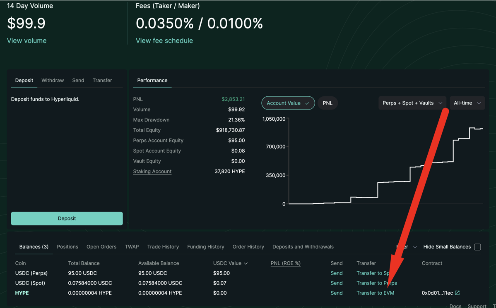

# Getting HYPE on Hyperliquid EVM

1. [Add Hyperliquid as a network to your wallet](getting-hype-on-hyperliquid-evm.md#bridging-from-arbitrum-sepolia-to-hyperliquid-l1-testnet)
2. [Transfer your HYPE from spot to evm ](getting-hype-on-hyperliquid-evm.md#hyperliquid-l1-less-than-greater-than-hyper-evm-1)
3. [Visit stakedhype.fi, connect wallet and stake. ](https://www.stakedhype.fi)
4. If you have any questions or having trouble, come visit us in our TG and we'll be happy to walk you through it [https://t.me/thundercove](https://t.me/thundercove)

### Bridge from Hyperliquid L1 -> Hyper EVM 

1\. Login to app.hyperliquid.xyz\
2\. Locate your HYPE assets\
3\. Click on "Transfer to EVM" and select your desired amount.&#x20;

<figure><figcaption></figcaption></figure>

### Adding HYPE Network to your wallet 

1. &#x20;Add Hyperliquid as a custom network in your wallet
   1. Network Name: Hyperliquid
   2. ChainID: 999
   3. RPC URL: https://rpc.hyperliquid.xyz/evm
   4. Currency Symbol: HYPE\
      \
      .png>)

